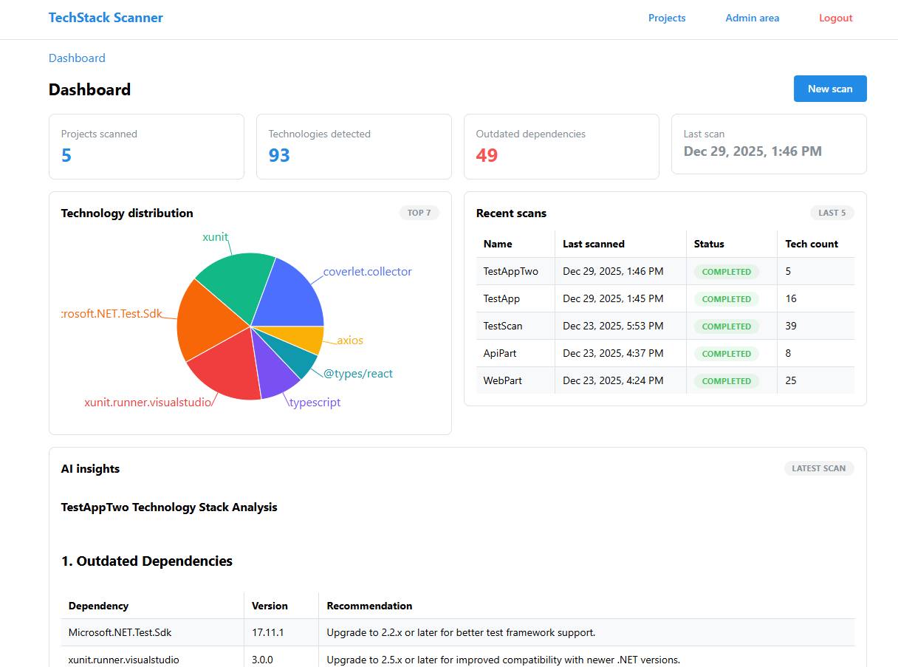

# 🔍 TechStack Scanner

[](https://dotnet.microsoft.com/)
[](https://react.dev/)
[](https://www.typescriptlang.org/)

A comprehensive tool for scanning software projects to detect technologies, dependencies, and generate AI-powered insights. Built with ASP.NET Core, React, and Ollama LLM integration.

## 📋 Table of Contents

- [Overview](#-overview)
- [Features](#-features)
- [Architecture](#-architecture)
- [Tech Stack](#-tech-stack)
- [Prerequisites](#-prerequisites)
- [Quick Start](#-quick-start)
- [Project Structure](#-project-structure)
- [Testing](#-testing)
- [API Documentation](#-api-documentation)
- [Configuration](#-configuration)
- [Docker Support](#-docker-support)
- [Contributing](#-contributing)
- [License](#-license)
- [AI Development](#-built-with-ai)

## 🎯 Overview

TechStack Scanner is a monorepo application that analyzes software project directories to identify:
- Programming languages and frameworks
- Package managers and dependencies
- Build tools and configuration files
- Containerization setup (Docker, docker-compose)
- Outdated dependencies with version tracking

The scanner integrates with **Ollama** (local LLM) to generate intelligent summaries and recommendations for detected technologies.



## ✨ Features

### Core Functionality
- 🔎 **Multi-language Detection** - Supports npm, NuGet, pip, PyPI, RubyGems, Go modules, Maven, Gradle
- 📦 **Dependency Scanning** - Parses `package.json`, `*.csproj`, `global.json`, `requirements.txt`, `pyproject.toml`, `Gemfile`, `Gemfile.lock`, `go.mod`, `go.sum`, `pom.xml`, `build.gradle`
- 🐳 **Docker Analysis** - Detects `Dockerfile` and `docker-compose.yml` configurations
- 📊 **Dashboard** - Visual overview of technologies across all scanned projects
- 🤖 **AI Insights** - Optional LLM-powered analysis via Ollama (llama3.2)
- ⏰ **Outdated Dependencies** - Automatic detection of outdated packages with latest version lookup
- 🔐 **JWT Authentication** - Secure admin-only scanning operations (admin area for demonstration purposes only)

### Technical Highlights
- ✅ **38 Unit Tests** - Comprehensive test coverage for scanning logic
- 🔄 **Background Processing** - Async scan queue with worker service
- 💾 **SQLite Database** - Lightweight persistence with EF Core migrations
- 🎨 **Modern UI** - React 18 + Mantine UI components
- 🌐 **REST API** - Clean ASP.NET Core Web API
- 📝 **Structured Logging** - Serilog with file and console sinks

## 🏗️ Architecture

### Monorepo Structure
```
techstack-scanner/
├── apps/
│   ├── api/              # ASP.NET Core 10 backend
│   ├── web/              # React + Vite frontend
│   └── api.Tests/        # xUnit test suite
├── packages/
│   └── shared/           # TypeScript shared types
└── docker/               # Docker configuration for Ollama
```

### Backend Architecture (ASP.NET Core)
```
┌─────────────────┐
│   Controllers   │  ← AuthController, ProjectsController, ScanController
└────────┬────────┘
         │
    ┌────▼─────┐
    │ Services │  ← ScanService, QueueService, LlmService, OutdatedDependencyService
    └────┬─────┘
         │
    ┌────▼────────┐
    │   Worker    │  ← ScanWorkerService (Background hosted service)
    └────┬────────┘
         │
    ┌────▼──────────┐
    │ EF Core + DB  │  ← AppDbContext → SQLite
    └───────────────┘
```

**Key Components:**
- **ScanService** - Parses project files and detects technologies
- **QueueService** - In-memory queue for scan requests
- **ScanWorkerService** - Background processor for queued scans
- **LlmService** - Integrates with Ollama for AI summaries
- **OutdatedDependencyService** - Checks npm, NuGet, PyPI, RubyGems for latest versions

### Frontend Architecture (React)
```
┌─────────────┐
│   Routes    │  ← React Router 7 (Dashboard, Projects, Login, Admin)
└──────┬──────┘
       │
  ┌────▼────────┐
  │  Contexts   │  ← AuthContext (JWT token management)
  └──────┬──────┘
         │
  ┌──────▼──────┐
  │   Hooks     │  ← TanStack Query (data fetching)
  └──────┬──────┘
         │
  ┌──────▼──────┐
  │ API Client  │  ← Axios with interceptors
  └─────────────┘
```

### Data Flow
```
User Triggers Scan
       ↓
API receives ScanRequest
       ↓
ScanService parses files → creates TechnologyFindings
       ↓
QueueService enqueues scan
       ↓
ScanWorkerService processes → OutdatedDependencyService checks versions
       ↓
LlmService generates summary (optional)
       ↓
Results saved to SQLite
       ↓
Frontend polls status → displays results
```

## 🛠️ Tech Stack

### Backend
- **Framework:** ASP.NET Core 10.0
- **Language:** C# 13
- **ORM:** Entity Framework Core 9.0
- **Database:** SQLite 3
- **Logging:** Serilog 8.0
- **Auth:** JWT Bearer tokens (9.0)
- **Testing:** xUnit, Moq, FluentAssertions

### Frontend
- **Framework:** React 18.3
- **Language:** TypeScript 5.6
- **Build Tool:** Vite 6.0
- **Router:** React Router 7.0
- **UI Library:** Mantine 7.13
- **State:** TanStack Query v5.62
- **HTTP Client:** Axios 1.7
- **Testing:** Vitest 2.1, Testing Library 16.1

### AI Integration
- **LLM Platform:** Ollama (local)
- **Model:** llama3.2 (default)
- **Deployment:** Docker container

### DevOps
- **Package Manager:** pnpm (frontend), NuGet (backend)
- **Containerization:** Docker + docker-compose
- **Linting:** ESLint 9, Prettier
- **CI/CD:** Ready for GitHub Actions

## 📋 Prerequisites

### Required
- **.NET SDK 10.0+** - [Download](https://dotnet.microsoft.com/download)
- **Node.js 18+** - [Download](https://nodejs.org/)
- **pnpm 9+** - Install: `npm install -g pnpm`
- **Git** - [Download](https://git-scm.com/)

### Optional (for AI features)
- **Docker Desktop** - [Download](https://www.docker.com/products/docker-desktop/)
- **Ollama** - [Download](https://ollama.ai/) (if running locally)

## 🚀 Quick Start

### 1. Clone Repository
```powershell
git clone https://github.com/ssalanoi/techstack-scanner.git
cd techstack-scanner
```

### 2. Start Backend (API)
```powershell
cd apps/api
dotnet run --urls http://localhost:5000
```

✅ **No environment variables needed!** Default development credentials:
- Email: `admin@techstack.local`
- Password: `ChangeMe123!`

### 3. Start Frontend (Web)
```powershell
# In a new terminal
cd apps/web
pnpm install  # First time only
pnpm dev
```

### 4. Access Application
Open **http://localhost:5173** in your browser

### 5. Optional: Start Ollama (for AI insights)

**Option A: Docker (Recommended)**
```powershell
cd docker
docker compose up -d
docker compose exec ollama ollama pull llama3.2
```

**Option B: Local Ollama**
```powershell
ollama serve
ollama pull llama3.2
```

### 🎉 You're Ready!
Login with default credentials and start scanning projects!

## 📁 Project Structure

```
techstack-scanner/
├── apps/
│   ├── api/                          # ASP.NET Core Backend
│   │   ├── Controllers/              # API endpoints
│   │   │   ├── AuthController.cs     # JWT authentication
│   │   │   ├── ProjectsController.cs # Projects CRUD
│   │   │   └── ScanController.cs     # Scan operations
│   │   ├── Data/
│   │   │   ├── AppDbContext.cs       # EF Core context
│   │   │   └── Entities/             # Database models
│   │   ├── Services/
│   │   │   ├── ScanService.cs        # Core scanning logic
│   │   │   ├── QueueService.cs       # In-memory queue
│   │   │   ├── ScanWorkerService.cs  # Background worker
│   │   │   ├── LlmService.cs         # Ollama integration
│   │   │   ├── OutdatedDependencyService.cs
│   │   │   └── JwtService.cs         # Token generation
│   │   ├── Migrations/               # EF Core migrations
│   │   ├── App_Data/                 # SQLite database
│   │   └── Logs/                     # Serilog logs
│   │
│   ├── api.Tests/                    # Backend Tests
│   │   ├── ScanServiceTests.cs       # 16 tests
│   │   ├── OutdatedDependencyServiceTests.cs  # 22 tests
│   │   └── LlmServiceTests.cs
│   │
│   └── web/                          # React Frontend
│       ├── src/
│       │   ├── components/           # Reusable UI components
│       │   ├── contexts/
│       │   │   └── AuthContext.tsx   # Auth state management
│       │   ├── hooks/
│       │   │   └── queries.ts        # TanStack Query hooks
│       │   ├── layouts/
│       │   │   ├── MainLayout.tsx
│       │   │   └── AdminLayout.tsx
│       │   ├── pages/
│       │   │   ├── Dashboard.tsx
│       │   │   ├── Projects.tsx
│       │   │   ├── ProjectDetails.tsx
│       │   │   ├── Login.tsx
│       │   │   └── Admin.tsx
│       │   ├── services/
│       │   │   └── api.ts            # Axios client
│       │   └── tests/                # Frontend tests
│       └── public/
│
├── packages/
│   └── shared/                       # Shared TypeScript Types
│       └── src/
│           └── types.ts              # Project, Scan, TechnologyFinding
│
├── docker/                           # Docker Configuration
│   ├── docker-compose.yml            # Ollama service
│   ├── init-ollama.sh                # Model initialization
│   └── README.md
│
├── config/                           # Shared Configs
│   ├── eslint.config.js
│   ├── prettier.config.js
│   └── tsconfig.base.json
│
├── QUICK_START.md                    # Quick setup guide
├── DOCKER.md                         # Docker documentation
├── E2E_VERIFICATION.md               # Testing guide
└── README.md                         # This file
```

## 🧪 Testing

### Backend Tests (xUnit)
```powershell
# Run all tests
dotnet test apps/api.Tests/api.Tests.csproj

# With verbose output
dotnet test apps/api.Tests/api.Tests.csproj --logger "console;verbosity=detailed"

# With coverage
dotnet test apps/api.Tests/api.Tests.csproj --collect:"XPlat Code Coverage"
```

**Test Coverage:**
- ✅ 16 tests for `ScanService` - File parsing, technology detection
- ✅ 22 tests for `OutdatedDependencyService` - Version comparison, registry integration
- ✅ Tests for npm, NuGet, PyPI, RubyGems, Maven, Gradle parsers
- 📊 **Total: 38 passing tests**

### Frontend Tests (Vitest)
```powershell
cd apps/web

# Run tests
pnpm test

# Watch mode
pnpm test:watch

# Coverage
pnpm test:coverage
```

### Linting
```powershell
# Frontend
pnpm lint:web

# Fix automatically
pnpm lint:web --fix
```

## 📚 API Documentation

### Base URL
- **Development:** `http://localhost:5000`
- **Swagger UI:** `http://localhost:5000/swagger` (dev mode only)

### Authentication
All protected endpoints require JWT token in `Authorization` header:
```
Authorization: Bearer <token>
```

### Endpoints

#### Authentication
```http
POST /api/auth/login
Content-Type: application/json

{
  "email": "admin@techstack.local",
  "password": "ChangeMe123!"
}

Response: { "token": "eyJhbGc..." }
```

#### Projects
```http
GET    /api/projects              # List all projects
GET    /api/projects/{id}         # Get project details
POST   /api/projects              # Create project
PUT    /api/projects/{id}         # Update project
DELETE /api/projects/{id}         # Delete project (cascade)
```

#### Scanning
```http
POST   /api/scan                  # Trigger new scan
GET    /api/scan/{scanId}/status  # Poll scan status
POST   /api/scan/{scanId}/check-outdated  # Re-check outdated deps
```

#### Technologies
```http
GET    /api/technologies          # Aggregate tech data for dashboard
```

#### Health
```http
GET    /health                    # Health check endpoint
Response: { "status": "healthy", "timestamp": "..." }
```

### Scan Request Example
```json
{
  "projectName": "My Project",
  "rootPath": "C:\\Projects\\my-project",
  "generateLlmSummary": true
}
```

### Scan Status Response
```json
{
  "id": 1,
  "status": "Completed",
  "findings": [
    {
      "name": "react",
      "version": "18.3.1",
      "category": "npm",
      "isOutdated": true,
      "latestVersion": "18.3.2"
    }
  ],
  "llmSummary": "This project uses React 18...",
  "createdAt": "2025-12-29T10:00:00Z"
}
```

## ⚙️ Configuration

### Backend Configuration

**appsettings.json** (default settings):
```json
{
  "Jwt": {
    "Issuer": "TechStackScanner",
    "Audience": "TechStackScanner",
    "ExpiryMinutes": 60
  },
  "Ollama": {
    "Host": "http://localhost:11434",
    "Model": "llama3.2",
    "TimeoutSeconds": 120
  },
  "ScanOptions": {
    "MaxDepth": 5
  }
}
```

**Environment Variables** (optional overrides):
```powershell
$env:JWT_SECRET = "your-custom-secret-minimum-32-characters"
$env:ADMIN_EMAIL = "admin@example.com"
$env:ADMIN_PASSWORD = "SecurePassword123!"
$env:OLLAMA_HOST = "http://localhost:11434"
$env:OLLAMA_MODEL = "llama3.2"
```

**User Secrets** (recommended for development):
```powershell
cd apps/api
dotnet user-secrets set "JWT_SECRET" "your-secret-here"
dotnet user-secrets set "ADMIN_EMAIL" "admin@example.com"
dotnet user-secrets set "ADMIN_PASSWORD" "SecurePassword123!"
```

### Frontend Configuration

**Environment Variables** (`.env` in `apps/web/`):
```env
VITE_API_URL=http://localhost:5000
```

## 🐳 Docker Support

Docker is used **only for Ollama** (LLM service). API and Web run locally.

### Start Ollama Container
```powershell
cd docker
docker compose up -d

# Pull model (first time)
docker compose exec ollama ollama pull llama3.2

# Check status
docker compose ps
curl http://localhost:11434/api/tags
```

### Stop Ollama
```powershell
cd docker
docker compose down

# Remove data (including downloaded models)
docker compose down -v
```

### Available Models
```powershell
# List models
docker compose exec ollama ollama list

# Pull different model
docker compose exec ollama ollama pull mistral

# Test model
docker compose exec ollama ollama run llama3.2 "Hello"
```

See [DOCKER.md](DOCKER.md) for detailed documentation.

## 🎮 Usage Guide

> **Note:** The admin area and authentication are for **demonstration purposes only**. This project showcases AI-assisted development and is not intended for production use without proper security hardening.

### 1. Login
Navigate to `http://localhost:5173/login` and use default credentials:
- Email: `admin@techstack.local`
- Password: `ChangeMe123!`

### 2. Scan a Project
1. Go to **Admin** page
2. Click **"New Scan"** button
3. Fill in:
   - **Project Name** - Display name
   - **Root Path** - Absolute path to project directory
   - **Generate LLM Summary** - Enable for AI insights (requires Ollama)
4. Click **"Start Scan"**
5. Wait for completion (status auto-refreshes)

### 3. View Results
- **Dashboard** - Overview of all technologies with charts
- **Projects** - List of all scanned projects
- **Project Details** - Click any project to see:
  - Technology findings (name, version, category)
  - Outdated dependencies (highlighted in orange)
  - AI summary (if generated)
  - Scan metadata

### 4. Refresh Outdated Check
On Project Details page, click **"Check for Outdated Dependencies"** to re-verify versions against package registries.

## 🛑 Stopping the Application

### Stop API
Press `Ctrl+C` in the terminal running `dotnet run`

### Stop Frontend
Press `Ctrl+C` in the terminal running `pnpm dev`

### Stop Ollama (Docker)
```powershell
cd docker
docker compose down
```

### Stop Ollama (Local)
Press `Ctrl+C` in the terminal running `ollama serve`

## 🐛 Troubleshooting

### Port Already in Use
```powershell
# Check what's using port 5000
netstat -ano | findstr :5000

# Kill the process
taskkill /F /PID <PID>
```

### Database Issues
```powershell
# Delete database and re-run migrations
Remove-Item apps\api\App_Data\scan.db
cd apps\api
dotnet run  # Migrations apply automatically
```

### Ollama Connection Failed
```powershell
# Check Ollama is running
curl http://localhost:11434/api/tags

# Restart Ollama (Docker)
cd docker
docker compose restart ollama

# Check logs
docker compose logs ollama
```

### Authentication Issues
- Check console output for displayed credentials
- Clear browser cache and localStorage
- Verify JWT_SECRET is set (or using default)

## 🤖 Built with AI

This project was developed entirely using **GitHub Copilot** (Claude Sonnet 4.5) as an AI pair programmer. The development process showcases effective AI-assisted software engineering with:

- **Prompt-driven development** - Features built through conversational interaction
- **Comprehensive testing** - 38 unit tests generated alongside features
- **Documentation-first** - Complete docs created during development
- **Iterative refinement** - Continuous improvement through AI collaboration

### Development Highlights
- 🏗️ Complete monorepo architecture designed and implemented
- 🧪 Test-driven development with comprehensive coverage
- 📚 Production-ready documentation suite
- 🐳 Docker configuration and deployment setup
- 🔍 Multi-language scanning with 7+ package managers
- 🤖 LLM integration for AI-powered insights

### More about AI-Assisted Development?
See [AI_DEVELOPMENT.md](AI_DEVELOPMENT.md) for project overview and quick links.

## 📖 Additional Documentation

- [QUICK_START.md](QUICK_START.md) - Quick setup guide with all steps
- [DOCKER.md](DOCKER.md) - Complete Docker guide for Ollama
- [E2E_VERIFICATION.md](E2E_VERIFICATION.md) - Testing and verification
- [AI_DEVELOPMENT.md](AI_DEVELOPMENT.md) - AI-assisted development overview
- [PROMPT_WORKFLOW_LOG.md](PROMPT_WORKFLOW_LOG.md) - Complete prompt history and development workflow
- [PROMPTING_INSIGHTS.md](PROMPTING_INSIGHTS.md) - Observations and lessons learned from AI-assisted development

## 🤝 Contributing

Contributions are welcome! Please follow these steps:

1. Fork the repository
2. Create a feature branch: `git checkout -b feature/amazing-feature`
3. Commit changes: `git commit -m 'Add amazing feature'`
4. Push to branch: `git push origin feature/amazing-feature`
5. Open a Pull Request

### Development Guidelines
- Write unit tests for new features
- Follow existing code style (ESLint, C# conventions)
- Update documentation for API changes
- Test both with and without Ollama integration

## 📝 License

This project is available for educational and personal use. For commercial use, please contact the author.

## 👥 Authors

- **ssalanoi** - *Initial work* - [GitHub](https://github.com/ssalanoi)

## 🙏 Acknowledgments

- [Ollama](https://ollama.ai/) - Local LLM platform
- [Mantine](https://mantine.dev/) - React UI library
- [ASP.NET Core](https://docs.microsoft.com/aspnet/core/) - Backend framework
- [Vite](https://vitejs.dev/) - Frontend build tool

## 📊 Project Stats

- **Lines of Code:** ~15,000+
- **Test Coverage:** 38 unit tests
- **Supported Languages:** C#, JavaScript/TypeScript, Python, Ruby, Go, Java
- **Package Managers:** npm, NuGet, pip, RubyGems, Go modules, Maven, Gradle
- **API Endpoints:** 15+
- **React Components:** 9 components

---

**Built with ❤️ using .NET 10, React 18, and AI**

For questions or issues, please [open an issue](https://github.com/ssalanoi/techstack-scanner/issues) on GitHub.
